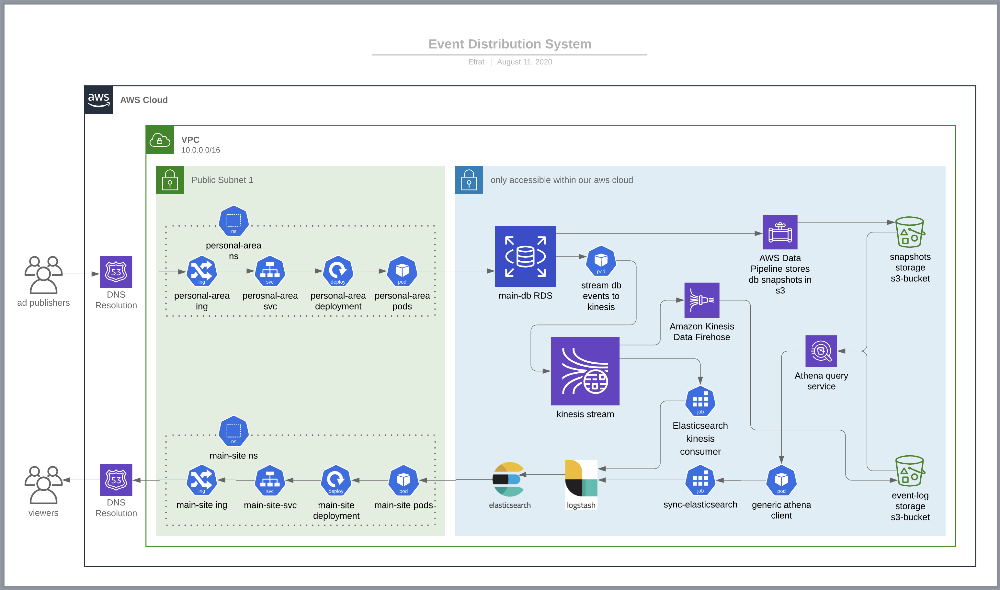

# kinesis-tf-stack

Full Event Distributing stack
[chart](https://app.lucidchart.com/documents/edit/618eac67-4a9a-4d10-a21c-cd3c95ae50cb/0_0)

 

## Functionality:
- Stream recent-past events from the DB to a centralized event-bus
- Subscribe Elasticsearch as a data consumer
- Preserve database transactions as an event-log
- Implement data-sourcing + CQRS architecture 

## Advantages:
- Generic support for all event types- create, update & delete.
- Efficient resource utilization due to the publisher-subscriber mechanism.
- Transactions data is preserved inorder to meet future BI data analytics requirements.
- Support for future embedding of various data consumers (e.g. mongoDB).
- Cloud native PaaS architecture.

## Drawbacks:
### Eventual Consistency: 
the CQRS model ensures high availability but loose consistency: read and write actions are handled by separated system, therefore data consistency impacted by factors like the overall throughput and network latency. That means it takes a while (a few minutes at normal behaviour) for an event to propagate to the feed.
system components (please refer to the chart):

## aws managed services:
- **Amazon kinesis streams:**
Will serve as the data hub in the system. New events will be pushed and any consumer will be able to pull them out.
- **Amazon simple storage service (S3):**
 will be used to store the compressed event-log and DB state snapshots.
- **Amazon kinesis firehose:**
will be used to collect events from kinesis stream, compress and store them in an S3 bucket as an event log. The event log will alway be preserved and in the future may be written to aws RedShift to perform OLAP queries.
- **Amazon Data pipeline:**
 on a predefined schedule (e.g. nightly), we will use this tool to perform DB snapshot and store it on S3 cold storage bucket.
- **Amazon athena query service for S3:**
Will be used to query the s3 buckets and pull their data in order to sync new event-consumers with the current state.
 
## Microservices:
- **mysql to kinesis:**
Will fire on every DB change, and write a new event to kinesis stream.
- **Elasticsearch kinesis consumer:**
 will broadcast live events from kinesis stream to our Elasticsearch stack
- **generic athena client**
 to perform log-retrieving queries and and sync new event-consumers with the current state.
- **sync-Elasticsearch job:**
Will ask the athena reader for former events and sync Elasticsearch accordingly

## Platform
The entire system will be hosted at aws cloud. services will be packaged as docker images and deployed to our aws eks cluster

## monitoring Tools
Amazon cloudWatch service will be used to monitor the aws native services. The microservices will be monitored by kubernets-native monitoring tools (i.e. prometheus stack)

## Development Platform
services local build using Dockerfiles & docker-compose

## Pricing:
- kinesis stream: (200 records per minute, 50kb each, 4 consumers): $30/month calculator
- Kinesis firehose:  $0.30/GB transferred
- Aws Data Pipeline: (high-frequency schedule): $1/month
- aws athena: $5/TB of data scanned
- aws s3: standard storage class (event-log): $23/TB
- aws s3: infrequent access class (snapshots): $12/TB
- EC2 Regional Data Transfer (RDS reading from same region): $0.02/GB
- Aws KMS (key management service): $0.03/10,000 requests
 
## Time estimation
Embedding aws services: 4 weeks
Microservices development: 4 weeks
